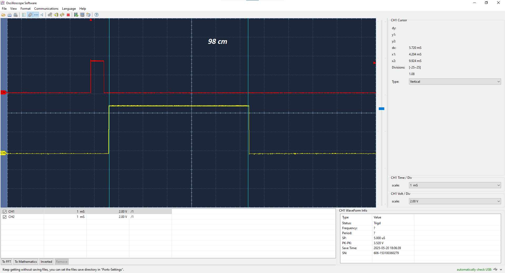

# URBANITE

## Authors

* **Maya Lopez Romero** - email: [maya.lopez@alumnos.upm.es](mailto:maya.lopez@alumnos.upm.es)
* **Alvaro Castillo Esteban** - email: [alvaro.castillo@alumno.upm.es](mailto:alcaro.castillo@alumnos.upm.es)

This project implements a parking assistance system using an STM32F446RE microcontroller. The system integrates a button interface, an ultrasound sensor for measuring distances, an RGB LED display for visual output, and low-power management.

## VERSION 1: Base System - FSM + Button

**Goal:** Build the foundational architecture with FSM, button control, and system tick timing.

**Components:**
* FSM for the button (anti-bounce, press detection)
* External Interrupt (EXTI) for button press
* SysTick timer to measure press duration
* Clear PORT / COMMON separation for portability
* Unit tests: test_fsm_button

## VERSION 2: Distance Measurement Subsystem

**Goal:** Add distance measurement using HC-SR04 ultrasound sensor.

**Components:**
* FSM for ultrasound logic
* PWM trigger signal (TIM3)
* Echo signal capture via Input Capture (TIM2)
* GPIO / Alternate Function configuration for Echo pin
* Unit tests: test_fsm_ultrasound, test_port_ultrasound

## VERSION 3: RGB LED Display Subsystem

**Goal:** Add a visual feedback system via RGB LED based on distance.

**Components:**
* FSM for RGB display management
* PWM signal generation (TIM4) for R, G, B
* Color computation from distance levels
* RGB LED connected to STM32 (cathode common)
* Unit tests: test_port_display

## VERSION 4: Final Integration + Low Power Modes

**Goal:** Integrate all components into a master FSM with power optimization.

**Components:**
* Urbanite FSM controlling all sub-FSMs
* Long press activates system; short press toggles display
* Power management:
* STOP/SLEEP modes via __WFI()
* SysTick suspend/resume
* ISR management
* Final tests and system-wide integration

_Para más información en realción con las distintas versiones, consultar en la [API](https://sdg2dieupm.github.io/urbanite/index.html)._

En las siguientes imágenes, se muestran las lecturas del osciloscopio para el _triger_ y _echo_ del ultrasound, para objetos a distancias de:
* 17cm
* 30cm
* 98cm
* 160cm
* 180cm

## VERSION 5: Mejoras y añadidos.

Para la V5, se decidió añadir múltiples mejoras y extras al proyecto Urbanite.

### Tiempos del botón.

Durante el desarrollo del proyecto, nos encontramos con problemas relacionados con los tiempos configurados para las distintas acciones del botón, ya que resultaban poco cómodos para trabajar. Por ello, se decidió ajustarlos.

* Tiempo para pausar el DISPLAY: 500 ms → 250 ms
* Tiempo de encendido y apagado (ON/OFF): 1000 ms (1 s)
* Tiempo de EMERGENCY: 3000 ms (3 s)

Estos cambios son menores, pero vale la pena mencionarlos. Para aplicarlos, solo fue necesario modificar las macros definidas en main.c.

### Nueva funcionalidad del botón y estado del URBANITE

Se decidió también añadir una nueva funcionalidad al botón: si se mantiene pulsado más de 3 s (este tiempo se detalló en el apartado anterior). Para ello, se modificaron varias funciones, incorporando este tiempo en `fsm_urbanite_init` y `fsm_urbanite_new`.

También se adaptó la función `check_off`, de forma que se independizó de `check_on` y se hizo que comparase si el tiempo de pulsación está entre 1 s y 3 s. Esto permite que para encender el sistema solo sea necesario mantener pulsado el botón más de 1 s, pero para apagarlo se requiera que se mantenga entre 1 s y 3 s.

Para crear este nuevo estado, se han añadido las variables `emergency` y `emergency_aux`. La variable `emergency` se utiliza para indicar que el sistema se encuentra en estado de emergencia.

Para entrar en este estado, se llama a `check_emergency_on`, que comprueba que el botón ha sido pulsado durante más de 3 s. Posteriormente, `do_start_emergency` se encarga de:

1. Resetear la duración del botón.
2. Activar el display (en caso de que estuviese parado).
3. Parar los ultrasonidos.
4. Poner `emergency_aux` y `emergency` a `true`.

Para desactivarlo, se llama a `check_emergency_off`, que comprueba si el botón se ha pulsado de nuevo durante 3 s, y luego llama a `do_stop_emergency`, que realiza las acciones inversas a `do_start_emergency`. La única excepción es el display: se comprueba si este estaba previamente parado para decidir si debe apagarse o no.

La función `check_emergency_continue` comprueba si se sigue en estado de emergencia (`emergency == true`) y, en ese caso, llama a `do_continue_emergency`. Esta función evalúa el valor de `emergency_aux` y, en función de si es `true` o `false`, encenderá el LED rojo durante un segundo o lo apagará, permitiendo así que parpadee.

Este sistema permite activar el estado de emergencia en cualquier momento, ya sea durante la medición (`MEASURE`) o en pausa (`SLEEP WHILE ON`), como se muestra a continuación:

En el video se muestra el funcionamiento de la siguiente manera:
1. OFF                  ->      MEASURE
2. MEASURE              ->      EMERGENCY
3. EMERGENCY            ->      MEASURE
4. MEASURE              ->      MEASURE en PAUSE
5. MEASURE en PAUSE     ->      EMERGENCY
6. EMERGENCY            ->      MEASURE en PAUSE
7. MEASURE en PAUSE     ->      MEASURE
8. MEASURE              ->      OFF

### Cambio gradual de colores.

Se decidió añadir tambien, el que los colores cambiasen gradualmente para el Display LED. Para esto se modifico la función `_compute_display_levels` del `fsm_display.c` y se incorporó la función `_interpolate_color`. Esta funcón nos ayuda a interpolar, es decir, calcular colores intermedios dentre las distintas transiciones discretas que ya habiamos establecido. 
Estos colores no se meten a pincho, si no que son calculados por `_interpolate_color`.

Los unicos colores para los que no se ha realizado esta transicion es para las distancia de +175cm, es decir, pasa de OFF (sin color) a azul directamente. De esta forma, se mantiene la intensidad del azul entre 175-200cm, lo cual consideramos que queda mejor.

En el siguiente video, se puede ver la demonstración del funcionamiento de esta transición. Para ello, hemos empleado el `example_v3.c` o una versión modificada de el que mantiene el color rojo (medida 0) un tiempo antes de reiniciar.

_Pedimos disculpas por los colores en el video, al no poderse apreciar con claridad_